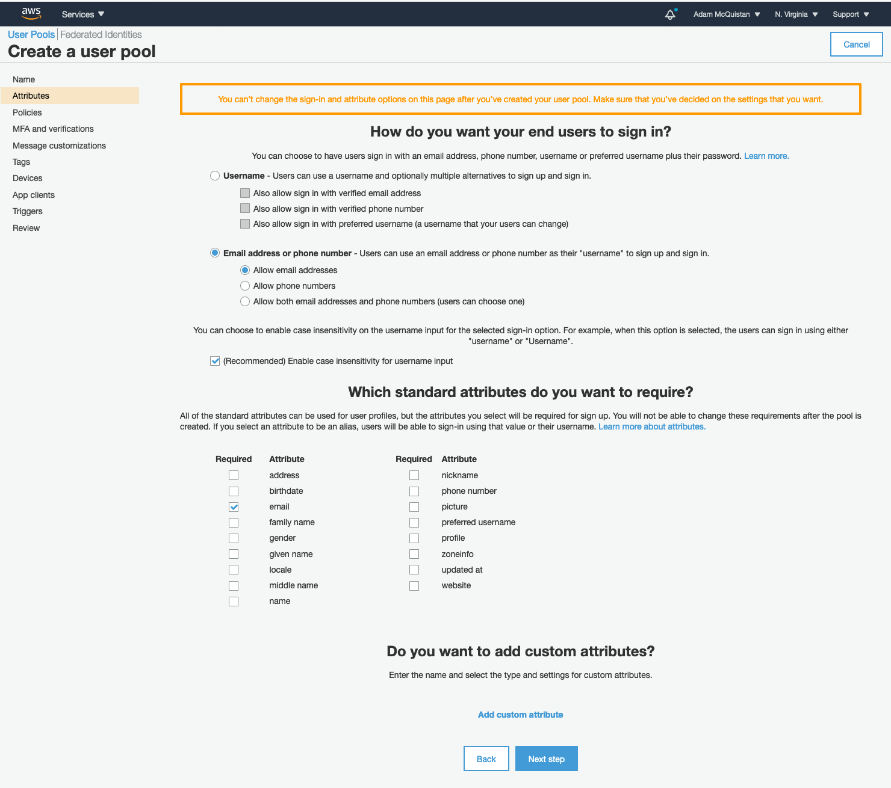

# Lots of Lists React Frontend with AWS Cognito and Amplify

This article will feature creating a Browser based Client using React with Create React App boilerplate generator which provides functionality to build and manage lists. This React app allows for User sign up, login and, logout using AWS Cognito User Pools, aided by the AWS Amplify library. A follow up article will demonstrate how to build out a REST API backend using AWS Serverless Application Model with AWS services of API Gateway, Lambda and DynamoDB all while harnessing the power of the Python programming language and familiar Flask microframework.

I will provide the code for the entire working solution throughout this series but, my primary focus will be on integrating the key software elements with the key AWS serverless services. Therefore, I do expect some level of familiarity of JavaScript and the React web ecosystem in this tutorial as well as Python and the Flask framework in the following article.

### Setting Up the React App

Use npx to generate the React App boiler plate with Create React App.

```
npx create-react-app tci-lol
cd tci-lol
```

Add some other JavaScript dependencies listed below.

```
yarn add axios aws-amplify bootstrap feather-icons \
  font-awesome jquery lodash luxon react-bootstrap \
  react-redux react-router-dom redux redux-thunk
```

### Mocking a REST API for Development with JSON Server

And a slick dev dependency named [JSON Server](https://github.com/typicode/json-server) for mocking the REST API because that doesn't exist yet.

```
yarn add json-server uuid --dev
```

To setup JSON Server I create a mockAPI directory then add a JavaScript file named dbInit.js which will serve to create a fresh database whenever necessary.

```
mkdir mockAPI
```

Next I add a Node.js script for creating, and backing up any existing, mock database represented as a simple JSON file.

```
// mockAPI/dbInit.js

const fs = require('fs');
const path = require('path');
const { v4: uuidv4 } = require('uuid');

const dbPath = path.join(__dirname, 'db.json');

if (fs.existsSync(dbPath)) {
  const backupPath = path.join(__dirname, 'db-backup.json');
  fs.renameSync(dbPath, backupPath);
  console.log(`Previous database backed up to ${backupPath}`);
}

const username = 'adammcquistan';

const mockData = {
  lists: [
    {
      id: uuidv4(),
      username,
      name: 'Learn Programming Languages',
      createdAt: Date.now(),
      completed: false,
      items: [
        { name: 'Java', completed: true },
        { name: 'Python', completed: true },
        { name: 'JavaScript', completed: true },
        { name: 'C Sharp', completed: false },
        { name: 'Go', completed: false }
      ]
    },
    {
      id: uuidv4(),
      username,
      name: 'Groceries',
      createdAt: Date.now(),
      completed: false,
      items: [
        { name: 'Milk', completed: false },
        { name: 'Eggs', completed: false },
        { name: 'Chicken Nuggets', completed: false },
        { name: 'Raisin Bran', completed: false }
      ]
    }
  ]
};

fs.writeFile(dbPath, JSON.stringify(mockData), err => {
  if (err) {
    console.log(err);
  } else {
    console.log(`Mock database created ${dbPath}`);
  }
});
```

After I add another Node.js script for spinning up the Express.js based JSON Server which mocks the Lists API that will eventually live in AWS as a Serverless Application Model REST API.

```
// mockAPI/index.js

const jsonServer = require('json-server');
const server = jsonServer.create();
const path = require('path');
const router = jsonServer.router(path.join(__dirname, 'db.json'));
const { v4: uuidv4 } = require('uuid');


const middlewares = jsonServer.defaults();

server.use(middlewares);

server.use(jsonServer.bodyParser);

// Simulate some delay on each request, you can tune this by changing delayMillisecs
const delayMillisecs = 30;
server.use((req, res, next) => setTimeout(next, delayMillisecs));

// simulate the data saving logic that the true API will do
server.post('/lists/', (req, res, next) => {
  req.body.createdAt = Date.now();
  req.body.username = 'adammcquistan';
  req.body.id = uuidv4();
  next();
});

server.use(router);

const port = 3009;
server.listen(port, () => {
  console.log(`JSON Server running on port ${port}`);
});
```

As a final step I add a new npm script to the package.json file that I can use to launch the mocked dev REST API.

```
"scripts": {
  "start": "react-scripts start",
  "start-api": "node ./mockAPI",
  "build": "react-scripts build",
  "test": "react-scripts test",
  "eject": "react-scripts eject"
},
```

### Creating AWS Cognito User Pool

To simply managing a user directory as well as the process of user signup and authentication I will be relying on [AWS Cognito](https://aws.amazon.com/cognito/), specifically Cognito User Pool, which exude the following features.

* Secure, low-cost, and fully managed user directory that scales to 100s of millions of users
* Built in, customizable UI for Sign up / Sign in
* OAuth 2.0 Support
* Federation with Facebook, Login with Amazon, Google and Custom OIDC/SAML providers

To further simply integrating Cognito User Pool and it's authentication super powers I will be using the [AWS Amplify](https://docs.aws.amazon.com/amplify/) library.

The first thing I must do is Log into my AWS Console and create a new Cognito User Pool in a desired region.


Then click on Manage User Pools button and on the following screen click Creater a user pool.


I name my user pool "The Coding Interface Lots of Lists" then click the Step through settings button.
 


On the attributes page I select sign in with email address then click next.



On the Policies as well as the MFA and verifications pages I accept the defaults and click next steps.

On the Message customizations screen I chenge the verification type to Link as opposed to Code so that newly registering users get a link to verify in their.


I again click through the Tags and Devices screens accepting the defaults.

On the App clients page I must add an Application Client to be used by the React app to interact with this Cognito User Pool.


On the Create App Client screen I name the client "TCI Lots of Lists Web Client" then scroll down to change a setting due to an implementation detail of the AWS Amplify library. I must uncheck the Generate client secret checkbox then I can click Create app client then next.


On the Triggers page I simply click Next step once again where I'm taken to the Review page to finally click Create pool button.

After AWS finishes creating the Cognito User Pool I need to grab the User Pool ID as well as the App Client ID.

In the General Settings page of the newly created Cognito User Pool I locate the Pool Id at the top and make note of it.


Then on the App clients page I similarly locate the App Client ID and make note of it.


Lastly, I need to go the Domain name page and enter a domain prefix for the app client.


### Scafolding Out the React App

At this point I want to get the basic structure of the app layed out so I have a good foundation to build on. Again, I'm assuming some familiarity with React here so I'll be moving a bit fast.

__Auth and User Management Action Types__

I start with the data store component of the React App, the redux store, specifically by defining the authentication action types which I place in the redux/actions/types.js shown below.

```
// redux/actions/types.js

export const SIGNUP_USER_SUCCESS = 'SIGNUP_USER_SUCCESS';
export const SIGNUP_USER_FAIL = 'SIGNUP_USER_FAIL';

export const LOGIN_USER_SUCCESS = 'LOGIN_USER_SUCCESS';
export const LOGIN_USER_FAIL = 'LOGIN_USER_FAIL';

export const AUTH_CHECK_SUCCESS = 'AUTH_CHECK_SUCCESS';
export const AUTH_CHECK_FAIL = 'AUTH_CHECK_FAIL';

export const LOGOUT_USER = 'LOGOUT_USER';

export const REQUEST_CHANGE_PASSWORD_SUCCESS = 'REQUEST_CHANGE_PASSWORD_SUCCESS';
export const REQUEST_CHANGE_PASSWORD_FAIL = 'REQUEST_CHANGE_PASSWORD_FAIL';

export const CHANGE_PASSWORD_SUCCESS = 'CHANGE_PASSWORD_SUCCESS';
export const CHANGE_PASSWORD_FAIL = 'CHANGE_PASSWORD_FAIL';
``` 

__Auth and User Management Redux Store with Reducers__

After defining some minimal action types I then add an reducer to handle authentication in redux/reducers/authReducer.js like so.

```
// redux/reducers/authReducer.js

import {
  SIGNUP_USER_SUCCESS,
  SIGNUP_USER_FAIL,
  LOGIN_USER_SUCCESS,
  LOGIN_USER_FAIL,
  AUTH_CHECK_SUCCESS,
  AUTH_CHECK_FAIL,
  LOGOUT_USER
} from '../actions/types';

function initState() {
  return {
    user: null,
    signupMessage: '',
    isAuthenticated: false,
    signUpErrorMessage: '',
    authenticationErrorMessage: ''
  };
}

const initialState = initState();

export default function(state = initialState, action) {
  console.log('authReducer action', action);
  switch(action.type) {
    case SIGNUP_USER_SUCCESS:
      return { ...state, signUpErrorMessage: '' };
    case SIGNUP_USER_FAIL:
      return { ...state, signUpErrorMessage: action.payload.errorMessage };
    case LOGIN_USER_SUCCESS:
      return { ...state, isAuthenticated: true, user: action.payload };
    case LOGIN_USER_FAIL:
      return { ...state, authenticationErrorMessage: action.payload.errorMessage, user: null, isAuthenticated: false };
    case AUTH_CHECK_SUCCESS:
      return { ...state, isAuthenticated: true };
    case AUTH_CHECK_FAIL:
      const newState = initState();
      newState.authenticationErrorMessage = state.authenticationErrorMessage || 'Please login';
      return newState;
    case LOGOUT_USER:
      return initState();
    default:
		return state;
  }
}
```

Next I setup the boiler plate to combine all of the reducers and state objects in the src/redux/reducers/index.js like so. And don't worry, I'm not totally crazy ... there will be more reducers that get added to this later, this is just necessary boiler plate setup.

```
// redux/reducers/index.js

import { combineReducers } from "redux";
import authReducer from './authReducer';


const rootReducer = combineReducers({
  auth: authReducer
});

export default rootReducer;
```

With the root reducer setup I can then configure the redux and thunk middleware in yet another redux file at redux/configureStore.js as shown below.

```
// redux/configureStore.js

import { createStore, applyMiddleware, compose } from "redux";
import thunk from 'redux-thunk';

import rootReducer from './reducers';


export default function configureStore(initialState) {
  const composeEnhancers = window.__REDUX_DEVTOOLS_EXTENSION_COMPOSE__ 
                              || compose; // add support for Redux dev tools
  return createStore(
    rootReducer,
    initialState,
    composeEnhancers(applyMiddleware(thunk))
  );
}
```

Now that I have the ability to configure and instantiate the redux store I need to make the React App aware of it by utilizing the Provier which ensures that each React component has access to the redux store.  Over in the React App's root index.js file I update it like so. Note that will I'm in boiler plate setup mode I also bring in the React Router and wrap the main App component also.

```
// index.js

import 'bootstrap/dist/css/bootstrap.min.css';
import 'bootstrap/dist/js/bootstrap.bundle.min.js';
import 'jquery/dist/jquery.min.js';
import "font-awesome/css/font-awesome.css";

import React from 'react';
import ReactDOM from 'react-dom';
import './index.css';
import App from './App';
import reportWebVitals from './reportWebVitals';

import configureStore from './redux/configureStore';
import { BrowserRouter as Router } from 'react-router-dom';
import { Provider } from 'react-redux';


const store = configureStore();

ReactDOM.render(
  <Provider store={store}>
    <Router>
      <App />
    </Router>
  </Provider>,
  document.getElementById('root')
);

// If you want to start measuring performance in your app, pass a function
// to log results (for example: reportWebVitals(console.log))
// or send to an analytics endpoint. Learn more: https://bit.ly/CRA-vitals
reportWebVitals();
```

__Auth and User Management Action Dispatch Stubs__

Carrying on with my initial setup of the React / React Redux skeleton I'll now add a few placeholder redux actions to enable initial minimal functionality before I tie in the integration with AWS Amplify and Cognito.

So back in the actions directory I make a new authAction.js file and place the following mocked actions.

```
// redux/actions/authActions.js

import {
  SIGNUP_USER_SUCCESS,
  SIGNUP_USER_FAIL,
  LOGIN_USER_SUCCESS,
  LOGIN_USER_FAIL,
  AUTH_CHECK_SUCCESS,
  AUTH_CHECK_FAIL,
  LOGOUT_USER,
  REQUEST_CHANGE_PASSWORD_SUCCESS,
  REQUEST_CHANGE_PASSWORD_FAIL,
  CHANGE_PASSWORD_SUCCESS,
  CHANGE_PASSWORD_FAIL
} from './types';

export const signupUser = ({ email, password }) => dispatch => {
  dispatch({ type: SIGNUP_USER_SUCCESS })
};

export const loginUser = ({ email, password }) => dispatch => {
  dispatch({ type: LOGIN_USER_SUCCESS, payload: { username: email } })
};

export const logoutUser = () => async dispatch => {
  dispatch({ type: LOGOUT_USER });
};

export const checkAuthStatus = () => async dispatch => {
  dispatch({ type: AUTH_CHECK_FAIL });
}

export const requestChangePassword = ({ email }) => async dispatch => {
  dispatch({ type: REQUEST_CHANGE_PASSWORD_SUCCESS });
};

export const changePassword = ({ email, code, password }) => async dispatch => {
  dispatch({ type: CHANGE_PASSWORD_SUCCESS });
};
```

__Application Navbar__

Now within the typical src/components directory I create a component file AppNavBar.js and rough in a standard Navbar with Sign Up, Log In, and Log Out links connected to the appropriate redux actions and state via the React Redux connect function.

```
// components/AppNavBar.js

import React, { Component } from 'react';
import { NavLink } from 'react-router-dom';
import { Nav, Navbar } from 'react-bootstrap';
import { connect } from 'react-redux';
import { checkAuthStatus } from "../redux/actions/authActions";


class AppNavBar extends Component {
  async componentDidMount() {
    try {
      await this.props.checkAuthStatus();
    } catch (e) {
      console.log('Error checking authenication', e)
    }
  }

  renderNavLinks() {
    return (
        <>
          <Navbar.Toggle aria-controls='responsive-navbar-nav'/>
          <Navbar.Collapse id="responsive-navbar-nav" className='justify-content-end'>
            <Nav variant='pills' defaultActiveKey='/signup'>
              {this.props.auth.isAuthenticated ? 
                (<Nav.Link as={NavLink} to='/logout'>Log Out</Nav.Link>)
                :
                (<>
                  <Nav.Link as={NavLink} to='/signup'>Sign Up</Nav.Link>
                  <Nav.Link as={NavLink} to='/login'>Log In</Nav.Link>
                </>)}
            </Nav>
          </Navbar.Collapse>
        </>
      );
  }

  render() {
    return (
      <Navbar bg='light' expand='lg'>
        <Navbar.Brand as={NavLink} to='/'>Lots of Lists</Navbar.Brand>
        {this.renderNavLinks()}
      </Navbar>
    );
  }
}

function mapStateToProps(state) {
  return { auth: state.auth };
}

function mapDispatchToProps(dispatch) {
  return {
    checkAuthStatus: () => dispatch(checkAuthStatus())
  };
}

export default connect(mapStateToProps, mapDispatchToProps)(AppNavBar);
```


To keep things simple and moving I also build out the following minimal primary view components referenced in the AppNavBar component to make sure the app has minimal functionality before running it.

__Home Page__

The HomePage component.

```
// components/HomePage.js

import React from 'react';

function HomePage() {
  return (
    <>
      <h2 className='my-4 text-center'>Lots of Lists</h2>
    </>
  );
}

export default HomePage;
```

__Sign Up Page__

The Sign Up Page.

```
// components/SignupPage.js

import React, { useState } from 'react';
import EmailField from './common/EmailField';
import PasswordField from './common/PasswordField';

import { signupUser } from '../redux/actions/authActions';
import { connect } from 'react-redux';

function SignupPage({ history, signupUserAction, auth }) {
  const [email, setEmail] = useState('');
  const [password, setPassword] = useState('');
  const [password2, setPassword2] = useState('');
  const [passwordError, setPasswordError] = useState('');
  const [password2Error, setPassword2Error] = useState('');

  function handleEmailChange(event) {
    setEmail(event.target.value)
  }
  function handlePasswordChange(event) {
    setPassword(event.target.value);

    if (event.target.value && event.target.value !== password2) {
      setPassword2Error('Passwords do not match');
    } else {
      setPasswordError('')
      setPassword2Error('')
    }
  }
  function handlePassword2Change(event) {
    setPassword2(event.target.value);

    if (event.target.value && password && password !== event.target.value) {
      setPassword2Error('Passwords do not match');
    } else {
      setPassword2Error('')
    }
  }
  async function handleSignup(event) {
    event.preventDefault();
    try {
      await signupUserAction({ email, password });
      history.push('/signup-confirm');
    } catch (e) {
      console.log('Error signing up', e);
    }
  }

  return (
    <>
      <h1>Sign Up</h1>

      <form onSubmit={handleSignup}>
        {auth.signUpErrorMessage && (<p className='alert alert-warning'>{auth.signUpErrorMessage}</p>)}
        <div className='form-group'>
          <EmailField
            name='email'
            label='Email'
            value={email}
            placeholder='Email'
            onChange={handleEmailChange}
          />
        </div>

        <div className='form-group'>
          <PasswordField 
            name='password'
            label='Password'
            value={password}
            placeholder='Password'
            error={passwordError}
            onChange={handlePasswordChange}
          />
        </div>

        <ul>
          <li>Password must be at least 8 characters</li>
          <li>Password must have at least one Uppercase Letter</li>
          <li>Password must have at least one Lowercase Letter</li>
          <li>Password must have at least one number</li>
          <li>Password must have at least one special symbol (!, @, #, ect ...)</li>
        </ul>

        <div className='form-group'>
          <PasswordField 
            name='password2'
            label='Password Verification'
            value={password2}
            placeholder='Password verification'
            error={password2Error}
            onChange={handlePassword2Change}
          />
        </div>
        
        <button type='submit' className='btn btn-primary' disabled={!email || !password || password !== password2}>
          Sign Up
        </button>
      </form>
    </>
  );
}

const mapDispatchToProps = {
  signupUserAction: signupUser
};

function mapStateToProps({ auth }) {
  return {
    auth
  }
}

export default connect(
  mapStateToProps,
  mapDispatchToProps
)(SignupPage);
```


__Log In Page__

The Log In Page.

```
// components/LoginPage.js

import React, { useState } from 'react';
import { Link } from 'react-router-dom';
import EmailField from './common/EmailField';
import PasswordField from './common/PasswordField';

import { loginUser } from '../redux/actions/authActions';
import { connect } from 'react-redux';

function LoginPage({ history, loginUserAction, auth }) {
  const [email, setEmail] = useState('');
  const [password, setPassword] = useState('');

  function handleEmailChange(event) {
    setEmail(event.target.value)
  }
  function handlePasswordChange(event) {
    setPassword(event.target.value);
  }
  async function handleLogin(event) {
    event.preventDefault();
    try {
      await loginUserAction({ email, password });
      history.push('/');
    } catch (e) {
      console.log('Error logging in', e);
    }
  }

  return (
    <>
      <h1>Login</h1>

      <form onSubmit={handleLogin}>
        {auth.authenticationErrorMessage && (<p className='alert alert-warning'>{auth.authenticationErrorMessage}</p>)}
        <div className='form-group'>
          <EmailField
            name='email'
            label='Email'
            value={email}
            placeholder='Email'
            onChange={handleEmailChange}
          />
        </div>

        <div className='form-group'>
          <PasswordField 
            name='password'
            label='Password'
            value={password}
            placeholder='Password'
            onChange={handlePasswordChange}
          />
        </div>

        <div className='field my-4'>
          <Link to='/request-change-password' className='btn btn-link'>Forgot password?</Link>
        </div>

        <button type='submit' className='btn btn-primary' disabled={!email || !password}>
          Login
        </button>
        
      </form>
    </>
  );
}

const mapDispatchToProps = {
  loginUserAction: loginUser
};

function mapStateToProps({ auth }) {
  return {
    auth
  }
}

export default connect(
  mapStateToProps,
  mapDispatchToProps
)(LoginPage);
```


__Log Out Page__

The Log Out Page.

```
// components/LogoutPage.js

import React, { useEffect } from 'react';
import { useHistory } from 'react-router-dom';
import { connect } from 'react-redux';
import { logoutUser } from '../redux/actions/authActions';

function LogoutPage({ logoutUserAction }) {
  const history = useHistory();
  useEffect(() => {
    logoutUserAction().then(() => {
      history.push('/login')
    })
  }, []);

  return (
    <>
      <h1>Logging Out ...</h1>
    </>
  );
}

const mapDispatchToProps = {
  logoutUserAction: logoutUser
};

export default connect(null, mapDispatchToProps)(LogoutPage);
```

__Forgot / Request Password Reset Page__

Request change password page.

```
// components/RequestChangePasswordPage.js

import React, { useState } from 'react';
import EmailField from './common/EmailField';

import { requestChangePassword } from '../redux/actions/authActions';
import { connect } from 'react-redux';

function RequestChangePasswordPage({ history, requestChangePasswordAction, auth }) {
  const [email, setEmail] = useState('');

  function handleEmailChange(event) {
    setEmail(event.target.value)
  }

  async function handleRequestChangePassword(event) {
    event.preventDefault();
    try {
      await requestChangePasswordAction({ email });
      history.push('/change-password');
    } catch (e) {
      console.log('Error logging in', e);
    }
  }

  return (
    <>
      <h1>Request Password Reset</h1>

      <form onSubmit={handleRequestChangePassword}>
        <p>Enter email associated with your account and you'll recieve a link to reset your password.</p>

        <div className='form-group'>
          <EmailField
            name='email'
            label='Email'
            value={email}
            placeholder='Email'
            onChange={handleEmailChange}
          />
        </div>

        <button type='submit' className='btn btn-primary' disabled={!email}>
          Submit
        </button>

      </form>
    </>
  );
}

const mapDispatchToProps = {
  requestChangePasswordAction: requestChangePassword
};

function mapStateToProps({ auth }) {
  return {
    auth
  }
}

export default connect(
  mapStateToProps,
  mapDispatchToProps
)(RequestChangePasswordPage);
```


__Change Password with Confirmation Code__

Change password with confirmation code page where a user would get an email with a code confirming they truly do have access to the email address of the account to which they are requesting a change of password for.

```
// components/RequestChangePasswordPage.js

import React, { useState } from 'react';
import EmailField from './common/EmailField';
import PasswordField from './common/PasswordField';
import TextField from './common/TextField';

import { changePassword } from '../redux/actions/authActions';
import { connect } from 'react-redux';

function ChangePasswordPage({ history, changePasswordAction, auth }) {
  const [email, setEmail] = useState('');
  const [code, setCode] = useState('');
  const [password, setPassword] = useState('');

  function handleEmailChange(event) {
    setEmail(event.target.value)
  }

  function handleCodeChange(event) {
    setCode(event.target.value);
  }

  function handlePasswordChange(event) {
    setPassword(event.target.value);
  }

  async function handleForgotPassword(event) {
    event.preventDefault();
    try {
      await changePasswordAction({ email, code, password });
      history.push('/login');
    } catch (e) {
      console.log('Error logging in', e);
    }
  }

  return (
    <>
      <h1>Change Password</h1>

      <form onSubmit={handleForgotPassword}>
        <p>Enter email associated with your account, the confirmation code, and your new password.</p>

        <div className='form-group'>
          <EmailField
            name='email'
            label='Email'
            value={email}
            placeholder='Email'
            onChange={handleEmailChange}
          />
        </div>

        <div className='form-group'>
          <TextField 
            name='code'
            label='Code'
            value={code}
            placeholder='Verification Code'
            onChange={handleCodeChange}
          />
        </div>

        <div className='form-group'>
          <PasswordField 
            name='password'
            label='Password'
            value={password}
            placeholder='Password'
            onChange={handlePasswordChange}
          />
        </div>

        <button type='submit' className='btn btn-primary' disabled={!email}>
          Login
        </button>

      </form>
    </>
  );
}

const mapDispatchToProps = {
  changePasswordAction: changePassword
};

function mapStateToProps({ auth }) {
  return {
    auth
  }
}

export default connect(
  mapStateToProps,
  mapDispatchToProps
)(ChangePasswordPage);
```


__Composing the App with React Router and Component Pages__

Finally, I can update the App.js component to put navigation of these pages under the control of React Router and introduce the concept of an authenticated user to differentiate standard vs private routes like so.

```
// App.js

import React, { Component } from 'react';
import { connect } from 'react-redux';
import { BrowserRouter as Router, Route, Switch, Redirect } from 'react-router-dom';
import { checkAuthStatus } from "./redux/actions/authActions";

import AppNavBar from './components/AppNavBar';
import HomePage from './components/HomePage';
import LoginPage from './components/LoginPage';
import LogoutPage from './components/LogoutPage';
import SignupPage from './components/SignupPage';
import SignupConfirmPage from './components/SignupConfirmPage';


function PrivateRoute({ component: Component, authenticated, ...rest }) {
  return (
    <Route 
      {...rest}
      render={props => authenticated ? <Component {...props}/> : <Redirect to='/login'/>}
    />
  );
}

class App extends Component {
  state = {
    isReady: false
  };
  async componentDidMount() {
    try {
      await this.props.checkAuthStatus();
    } catch (e) {
      console.log('Error checking authenication', e)
    }
    this.setState({ isReady: true });
  }

  render() {
    return this.state.isReady && (
      <div className="App">
        <Router>
          <AppNavBar/>
          <div className='container-fluid mt-4'>
            
            <Switch>
              <Route path="/login" component={LoginPage}/>
              <Route path="/signup" component={SignupPage}/>
              <Route path="/signup-confirm" component={SignupConfirmPage}/>
              <Route path="logout" component={LogoutPage}/>
              <PrivateRoute path="/" exact component={HomePage} authenticated={this.props.auth.isAuthenticated}/>
            </Switch>
          </div>
        </Router>
      </div>
    );
  }
}

function mapStateToProps(state) {
  return { auth: state.auth };
}

function mapDispatchToProps(dispatch) {
  return {
    checkAuthStatus: () => dispatch(checkAuthStatus())
  };
}

export default connect(mapStateToProps, mapDispatchToProps)(App);
``` 

### Configuring AWS Amplify Javascript Library

Early on in the initial setup of the Lots of Lists React App I used yarn to install the aws-amplify JavaScript library and shortly after that I established a Cognito User Pool to handle the backend authentication and manage the Pool of Users for specified App Client. During that setup I made note of two things: (1) the Cognito User Pool ID and (2) the App Client ID which I will now use to configure the Amplify Library.

__Configuring Amplify with Create React App Environment Variables__

In my root project directory I create a traditional .env environment variable file with the following placeholders.

```
# .env

REACT_APP_API_BASE_URL=
REACT_APP_COGNITO_USER_POOL_ID=
REACT_APP_COGNITO_APP_CLIENT_ID=
REACT_APP_COGNITO_REGION=
```

Following that I create yet another environment variable file .env.local which will hold the values to the same variables defined but, specific to local development and containing the values I made note of during the Cognito setup as well as Mock API setup.

```
# .env.local

REACT_APP_API_BASE_URL=http://localhost:3009
REACT_APP_COGNITO_USER_POOL_ID=us-east-1_the-rest-of-the-pool-id
REACT_APP_COGNITO_APP_CLIENT_ID=my-app-client-id
REACT_APP_COGNITO_REGION=us-east-1
```

Now back over in the project's root index.js file I import the base Amplify object and configure it like so.

```
// index.js

import 'bootstrap/dist/css/bootstrap.min.css';
import 'bootstrap/dist/js/bootstrap.bundle.min.js';
import 'jquery/dist/jquery.min.js';
import "font-awesome/css/font-awesome.css";

import React from 'react';
import ReactDOM from 'react-dom';
import './index.css';
import App from './App';
import reportWebVitals from './reportWebVitals';

import configureStore from './redux/configureStore';
import { BrowserRouter as Router } from 'react-router-dom';
import { Provider } from 'react-redux';
import Amplify from 'aws-amplify';
import axios from 'axios';

Amplify.configure({
  mandatorySignIn: true,
  region: process.env.REACT_APP_COGNITO_REGION,
  userPoolId: process.env.REACT_APP_COGNITO_USER_POOL_ID,
  userPoolWebClientId: process.env.REACT_APP_COGNITO_APP_CLIENT_ID
});

axios.defaults.baseURL = process.env.REACT_APP_API_BASE_URL

const store = configureStore();

ReactDOM.render(
  <Provider store={store}>
    <Router>
      <App />
    </Router>
  </Provider>,
  document.getElementById('root')
);

// If you want to start measuring performance in your app, pass a function
// to log results (for example: reportWebVitals(console.log))
// or send to an analytics endpoint. Learn more: https://bit.ly/CRA-vitals
reportWebVitals();
```


### Implementing User Sign Up

Much of the heavy lifting has been done already so implementing Sign Up functionality with the AWS Amplify library will actually be a piece of cake.

Over in authActions.js I import the Auth object from the aws-amplify library and use it's signUp(...) method within the signupUser action as shown below. The below code should be pretty self explanatory but, be sure to checkout the [AWS Amplify Sign Up docs](https://docs.amplify.aws/lib/auth/emailpassword/q/platform/js#sign-up) for details.

```
// redux/actions/authActions.js

import {
  SIGNUP_USER_SUCCESS,
  SIGNUP_USER_FAIL,
  LOGIN_USER_SUCCESS,
  LOGIN_USER_FAIL,
  AUTH_CHECK_SUCCESS,
  AUTH_CHECK_FAIL,
  LOGOUT_USER,
  REQUEST_CHANGE_PASSWORD_SUCCESS,
  REQUEST_CHANGE_PASSWORD_FAIL,
  CHANGE_PASSWORD_SUCCESS,
  CHANGE_PASSWORD_FAIL
} from './types';

import { Auth } from 'aws-amplify';

export const signupUser = ({ email, password }) => async dispatch => {
  try {
    const { user } = await Auth.signUp({ username: email, password, attributes: { email } });
    console.log(user);
    dispatch({ type: SIGNUP_USER_SUCCESS });
    return user;
  } catch (e) {
    e.message = e.message || 'Error signing up';
    dispatch({ type: SIGNUP_USER_FAIL, payload: { errorMessage: e.message }});
    throw e;
  }
};

// ... omitting the other action methods for brevity
```

Now if I were to visit my Sign Up page, enter a valid email and password conforming to the password policy I'll get redirected to my Sign Up confirmation page asking me to go check my email for a confirm link.


After clicking the confirm link in the email Cognito sent on my behalf I can then login (once I implement that functionality of course).

### Implementing User Log In

At this point I can head back over to my authActions.js file and implement another similar method on the AWS Amplify Auth object called signIn(...) within the loginUser action.

```
// redux/actions/authActions.js

import {
  SIGNUP_USER_SUCCESS,
  SIGNUP_USER_FAIL,
  LOGIN_USER_SUCCESS,
  LOGIN_USER_FAIL,
  AUTH_CHECK_SUCCESS,
  AUTH_CHECK_FAIL,
  LOGOUT_USER,
  REQUEST_CHANGE_PASSWORD_SUCCESS,
  REQUEST_CHANGE_PASSWORD_FAIL,
  CHANGE_PASSWORD_SUCCESS,
  CHANGE_PASSWORD_FAIL
} from './types';

import { Auth } from 'aws-amplify';

export const loginUser = ({ email, password }) => async dispatch => {
  try {
    const user = await Auth.signIn(email, password);
    console.log(user);
    dispatch({ type: LOGIN_USER_SUCCESS, payload: user });
    return user;
  } catch (e) {
    e.message = e.message || 'Error logging in';
    dispatch({ type: LOGIN_USER_FAIL, payload: { errorMessage: e.message } });
    throw e;
  }
};

// ... omitting the other action methods for brevity
```

With this newly updated loginUser action impelmented using the AWS Amplify Auth.signIn(...) method I can now sign in with my newly registered user. Again, please consult the [AWS Amplify Sign In docs](https://docs.amplify.aws/lib/auth/emailpassword/q/platform/js#sign-in) for more details of the signIn(...) method.

### Implementing a Proper User Authentication Check

You likely have noticed that in the App.js and AppNavBar.js components I have used called the checkAuthStatus() action upon component loading. This is necessary to verify that there is a non-expired session represented by the presence of the user's access token in the Browser's Local Storage. Once again, the AWS Amplify library nicely abstracts this via the Auth.currentSession() method which validates that the access token in Local Storage is not expired, and if it is AWS Amplify will request a new one with the Cognito backend service by presenting a valid refresh token. If the refresh token is expired or the Local Storage has been cleared then a full email and password user Authentication is required. Have a look at the [AWS Amplify docs](https://docs.amplify.aws/lib/auth/overview/q/platform/js#accessing-aws-services) for more details.

```
// redux/actions/authActions.js

import {
  SIGNUP_USER_SUCCESS,
  SIGNUP_USER_FAIL,
  LOGIN_USER_SUCCESS,
  LOGIN_USER_FAIL,
  AUTH_CHECK_SUCCESS,
  AUTH_CHECK_FAIL,
  LOGOUT_USER,
  REQUEST_CHANGE_PASSWORD_SUCCESS,
  REQUEST_CHANGE_PASSWORD_FAIL,
  CHANGE_PASSWORD_SUCCESS,
  CHANGE_PASSWORD_FAIL
} from './types';

import axios from 'axios';
import { Auth } from 'aws-amplify';

export const checkAuthStatus = () => async dispatch => {
  try {
    const session = await Auth.currentSession();
    axios.defaults.headers.common['Authorization'] = `Bearer ${session.getAccessToken().jwtToken}`;
    dispatch({ type: AUTH_CHECK_SUCCESS });
    const user = Auth.currentAuthenticatedUser();
    return user;
  } catch(e) {
    dispatch({ type: AUTH_CHECK_FAIL });
    throw e;
  }
};

// ... omitting the other action methods for brevity
```

### Implementing User Log Out

Again, the AWS Amplify library makes providing logout functionality easy via another logically named method signOut().

```
// redux/actions/authActions.js

import {
  SIGNUP_USER_SUCCESS,
  SIGNUP_USER_FAIL,
  LOGIN_USER_SUCCESS,
  LOGIN_USER_FAIL,
  AUTH_CHECK_SUCCESS,
  AUTH_CHECK_FAIL,
  LOGOUT_USER,
  REQUEST_CHANGE_PASSWORD_SUCCESS,
  REQUEST_CHANGE_PASSWORD_FAIL,
  CHANGE_PASSWORD_SUCCESS,
  CHANGE_PASSWORD_FAIL
} from './types';

import axios from 'axios';
import { Auth } from 'aws-amplify';

export const logoutUser = () => async dispatch => {
  try {
    await Auth.signOut();
  } catch(e) {
    console.log('Error logging out', e);
    localStorage.clear();
  }
  dispatch({ type: LOGOUT_USER });
};

// ... omitting the other action methods for brevity
```

### Implementing Forgot / Request Password Change

My implementation for password resets as well as forgot password is dual purposed in this example meaning that they use the same UI and flow. To provide the functionality I simply need to provide a redux action dispatch function for requesting having a password reset which will email a confirmation code to the supplied email if it truly is associated with a user account followed by a second dispatch that accepts a email, the confirmation code, and a new password. Of course these are once again mere wrappers for the AWS Amplify library's Auth methods as shown below.

```
// redux/actions/authActions.js

import {
  SIGNUP_USER_SUCCESS,
  SIGNUP_USER_FAIL,
  LOGIN_USER_SUCCESS,
  LOGIN_USER_FAIL,
  AUTH_CHECK_SUCCESS,
  AUTH_CHECK_FAIL,
  LOGOUT_USER,
  REQUEST_CHANGE_PASSWORD_SUCCESS,
  REQUEST_CHANGE_PASSWORD_FAIL,
  CHANGE_PASSWORD_SUCCESS,
  CHANGE_PASSWORD_FAIL
} from './types';

import axios from 'axios';
import { Auth } from 'aws-amplify';

export const requestChangePassword = ({ email }) => async dispatch => {
  try {
    const response = await Auth.forgotPassword(email);
    dispatch({ type: REQUEST_CHANGE_PASSWORD_SUCCESS });
    return response;
  } catch (e) {
    console.log('Error requsting change of password', e);
    dispatch({ type: REQUEST_CHANGE_PASSWORD_FAIL });
    throw e;
  }
};

export const changePassword = ({ email, code, password }) => async dispatch => {
  try {
    const response = await Auth.forgotPasswordSubmit(email, code, password);
    dispatch({ type: CHANGE_PASSWORD_SUCCESS });
    return response;
  } catch(e) {
    console.log('Error chaning password', e);
    dispatch({ type: CHANGE_PASSWORD_FAIL });
    throw e;
  }
};
```

### Implementing User List CRUD

With the Authentication and User Management functionality in place I can move on to implementing the actual value generating features of my app, namely the ability to generate lists to aid users to keep track of tasks and other activities that are likely to be forgotten such as grocery lists, holiday gift lists, and countless other things.  

__List Management Action Types__

To start I fill in some reasonable list management action types.

```
// redux/actions/types.js

// ... omitting the other action types for brevity

/* List Management Action Types */
export const FETCH_LISTS_SUCCESS = 'FETCH_LISTS_SUCCESS';
export const FETCH_LISTS_FAIL = 'FETCH_LISTS_FAIL';

export const CREATE_LIST_SUCCESS = 'CREATE_LIST_SUCCESS';
export const CREATE_LIST_FAIL = 'CREATE_LIST_FAIL';

export const UPDATE_LIST_SUCCESS = 'UPDATE_LIST_SUCCESS';
export const UPDATE_LIST_FAIL = 'UPDATE_LIST_FAIL';

export const DELETE_LIST_SUCCESS = 'DELETE_LIST_SUCCESS';
export const DELETE_LIST_FAIL = 'DELETE_LIST_FAIL';
```

__List Management Action Dispatchers__


```
// redux/actions/listActions.js

import {
  FETCH_LISTS_SUCCESS,
  FETCH_LISTS_FAIL,

  CREATE_LIST_SUCCESS,
  CREATE_LIST_FAIL,

  UPDATE_LIST_SUCCESS,
  UPDATE_LIST_FAIL,

  DELETE_LIST_SUCCESS,
  DELETE_LIST_FAIL
} from "./types";

import axios from 'axios';

export const fetchLists = () => async dispatch => {
  try {
    const resp = await axios.get('/lists/');
    console.log('Fetch lists response', resp);
    dispatch({ type: FETCH_LISTS_SUCCESS, payload: resp.data });
    return resp;
  } catch (e) {
    e.message = e.message || 'Error encountered fetching lists';
    console.log('Error fetching lists', e);
    dispatch({ type: FETCH_LISTS_FAIL, error: e });
    throw e;
  }
};

export const createList = ({ name, completed, items }) => async dispatch => {
  try {
    const resp = await axios.post('/lists/', { name, completed, items });
    console.log('Create list response', resp);
    dispatch({ type: CREATE_LIST_SUCCESS, payload: resp.data });
    return resp;
  } catch (e) {
    e.message = e.message || 'Error encountered creating list';
    console.log('Error creating list', e);
    dispatch({ type: CREATE_LIST_FAIL, error: e });
    throw e;
  }
};

export const updateList = ({ id, name, completed, items }) => async dispatch => {
  try {
    const resp = await axios.put(`/lists/${id}/`, { id, name, completed, items });
    console.log('Update list response', resp);
    dispatch({ type: UPDATE_LIST_SUCCESS, payload: resp.data });
    return resp;
  } catch (e) {
    e.message = e.message || 'Error encountered updating list';
    console.log('Error updating list', e);
    dispatch({ type: UPDATE_LIST_FAIL, error: e });
    throw e;
  }
};

export const deleteList = ({ id }) => async dispatch => {
  try {
    const resp = await axios.delete(`/lists/${id}/`);
    console.log('Delete list response', resp);
    dispatch({ type: DELETE_LIST_SUCCESS });
    return resp;
  } catch (e) {
    e.message = e.message || 'Error encountered deleting list';
    console.log('Error deleting list', e);
    dispatch({ type: DELETE_LIST_FAIL, error: e });
    throw e;
  }
};
```

__List Management Redux Store and Reducers__

Now I put in the list reducers to handle state updates the list action dispatch types. 

```
// redux/reducers/listReducer.js

import { 
  FETCH_LISTS_SUCCESS,
  FETCH_LISTS_FAIL,

  CREATE_LIST_SUCCESS,
  CREATE_LIST_FAIL,

  UPDATE_LIST_SUCCESS,
  UPDATE_LIST_FAIL,

  DELETE_LIST_SUCCESS,
  DELETE_LIST_FAIL
 } from "../actions/types";

function initState() {
  return {
    lists: [],
    fetchListErrorMessage: '',
    createListErrorMessage: '',
    updateListErrorMessage: '',
    deleteListErrorMessage: ''
  };
}

function updateState(key, value, oldState = null) {
  const newState = oldState ? { ...oldState } : initState();
  newState[key] = value;
  return newState;
}

const initialState = initState();

export default function(state = initialState, action) {
  console.log('listReducer action', action);

  switch(action.type) {
    case FETCH_LISTS_SUCCESS:
      return updateState('lists', action.payload);
    case FETCH_LISTS_FAIL:
      return updateState('fetchListErrorMessage', action.payload.error.message);
    case CREATE_LIST_SUCCESS:
      return updateState('lists', state.lists.concat([action.payload]));
    case CREATE_LIST_FAIL:
      return updateState('createListErrorMessage', action.payload.error.message, oldState = state);
    case UPDATE_LIST_SUCCESS:
      const updatedList = action.payload;
      const listsCopy = state.lists.slice();
      const idx = listsCopy.findIndex((item) => item.id === updatedList.id);
      listsCopy[idx] = updatedList;
      return updateState('lists', listsCopy);
    case UPDATE_LIST_FAIL:
      return updateState('updateListErrorMessage', action.payload.error.message, oldState = state);
    case DELETE_LIST_SUCCESS:
      // assume fresh list fetch after successful delete so ... just return empty state
      return initState();
    case DELETE_LIST_FAIL:
      return updateState('deleteListErrorMessage', action.payload.error.message, oldState = state);
    default:
      return state;
  }
}
```

With the reducers defined for the management of list state I can update the root reducer definition in redux/reducers/index.js as shown below.

```
// redux/reducers/index.js

import { combineReducers } from "redux";
import authReducer from './authReducer';
import listReducer from './listReducer';


const rootReducer = combineReducers({
  auth: authReducer,
  lists: listReducer
});

export default rootReducer;
```

### Conclusion

In this article I have described how to integrate a simple React application built from Create React App with AWS Cognito User Pools and AWS Amplify JavaScript client library.


